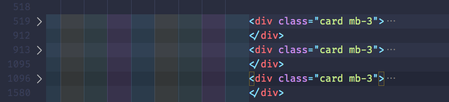

# Multiple form wizard on registration page

### CSS

#### 1. copy css code below and pest it after `<link../>` tags in the **`<head>..</head>`**</br>
approximately at line number 34_

```css
<style>
        /* Mark input boxes that gets an error on validation: */
        /* input.invalid {
  background-color: #ffdddd;
} */

        /* Hide all steps by default: */
        .tab {
            display: none;
        }

        /* Make circles that indicate the steps of the form: */
        .step {
            height: 15px;
            width: 15px;
            margin: 0 2px;
            background-color: #bbbbbb;
            border: none;
            border-radius: 50%;
            display: inline-block;
            opacity: 0.5;
        }

        /* Mark the active step: */
        .step.active {
            opacity: 1;
        }

        /* Mark the steps that are finished and valid: */
        .step.finish {
            background-color: #4CAF50;
        }
    </style>
```

#### 2. Giv a class name **`tab`** for each three tables in the wizard</br>
   fined class name **`card mb-3`** and pest in between **`card tab mb-3`**</br> _approximately at line No. 519, 913 and 1096._
   

#### 3. Comment or delete the privies buttons nex to the last wizard table</br>
   _approximately at line 1581._

```html
<div class="col-sm-6">
	<div class="row form-group">
		<div class="col-sm-6">
			<input
				type="submit"
				onclick="return Validate('Update');"
				class="btn btn-primary localize"
				value="Update"
			/>
			<button type="button" class="btn bg-danger localize">Reset</button>
		</div>
	</div>
</div>
```

#### 4. Replace new buttons code</br>
   Replace the code below after the commented old butter or pest on it to delete.

```html
<div style="overflow:auto;">
	<div style="float:right;">
		<button
			type="button"
			class="btn btn-secondary rounded-0"
			id="prevBtn"
			onclick="nextPrev(-1)"
		>
			Previous
		</button>
		<button
			type="button"
			class="btn btn-primary rounded-0"
			id="nextBtn"
			onclick="nextPrev(1)"
		>
			Next
		</button>
	</div>
</div>
```

#### 5. Add wizard indicator dots</br> 
Copy and pest the code below just after the closing tag `</div>` of the new buttens code.   

````html
<!-- Circles which indicates the steps of the form: -->
<div style="text-align:center;margin-top:35px;">
	<span class="step"></span>
	<span class="step"></span>
	<span class="step"></span>
	<!-- <span class="step"></span> -->
</div>
````
#### 6. javaScript </br>
Finally copy and pest the javaScript code before the closing **`</body>`** tag 

```javaScript
<script>
        var currentTab = 0; // Current tab is set to be the first tab (0)
        showTab(currentTab); // Display the current tab

        function showTab(n) {
            // This function will display the specified tab of the form ...
            var x = document.getElementsByClassName("tab");
            x[n].style.display = "block";
            // ... and fix the Previous/Next buttons:
            if (n == 0) {
                document.getElementById("prevBtn").style.display = "none";
            } else {
                document.getElementById("prevBtn").style.display = "inline";
            }
            if (n == (x.length - 1)) {
                document.getElementById("nextBtn").innerHTML = "Submit";
            } else {
                document.getElementById("nextBtn").innerHTML = "Next";
            }
            // ... and run a function that displays the correct step indicator:
            fixStepIndicator(n)
        }

        function nextPrev(n) {
            // This function will figure out which tab to display
            var x = document.getElementsByClassName("tab");
            // Exit the function if any field in the current tab is invalid:
            if (n == 1 && !validateForm()) return false;
            // Hide the current tab:
            x[currentTab].style.display = "none";
            // Increase or decrease the current tab by 1:
            currentTab = currentTab + n;
            // if you have reached the end of the form... :
            if (currentTab >= x.length) {
                //...the form gets submitted:
                document.getElementById("regForm").submit();
                return false;
            }
            // Otherwise, display the correct tab:
            showTab(currentTab);
        }

        function validateForm() {
            // This function deals with validation of the form fields
            var x, y, i, valid = true;
            x = document.getElementsByClassName("tab");
            y = x[currentTab].getElementsByTagName("input");
            // A loop that checks every input field in the current tab:
            for (i = 0; i < y.length; i++) {
                // If a field is empty...
                if (y[i].value == "") {
                    // add an "invalid" class to the field:
                    y[i].className += " invalid";
                    // and set the current valid status to false:
                    valid = true;
                }
            }
            // If the valid status is true, mark the step as finished and valid:
            if (valid) {
                document.getElementsByClassName("step")[currentTab].className += " finish";
            }
            return valid; // return the valid status
        }

        function fixStepIndicator(n) {
            // This function removes the "active" class of all steps...
            var i, x = document.getElementsByClassName("step");
            for (i = 0; i < x.length; i++) {
                x[i].className = x[i].className.replace(" active", "");
            }
            //... and adds the "active" class to the current step:
            x[n].className += " active";
        }
    </script>
```
